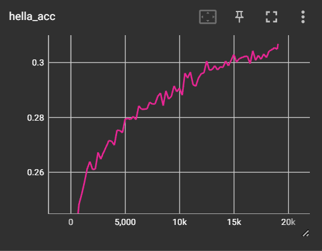

### GPT2 - pre-training and fine-tuning 

fine-tuning strategies on  GPT2 to check if alignment from human feedback help older, smaller models like GPT2 improve output 

Pre-training 
    1. GPT2 - 124M on FineWeb-Edu

Alignment stages (similar to InstructGPT)
    1. SFT 
    2. Reward Model 
    3. RLHF

| Stage | Dataset | Details|
| ------------- | ------------- |------------- |
| Pre-training | FineWeb-Edu | HellaSwag Accuracy: 30.81% |
| SFT          |  ||
| Reward Model |  ||
| RLHF         |  ||
| QA Context Extraction| SQUAD ||

